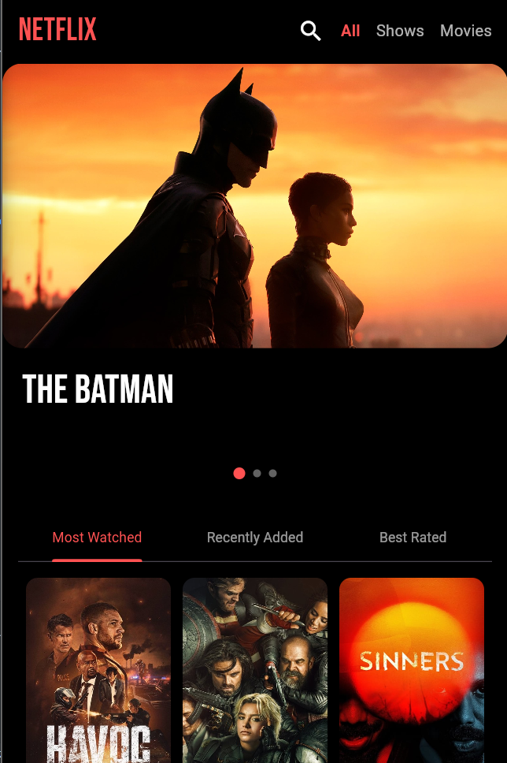
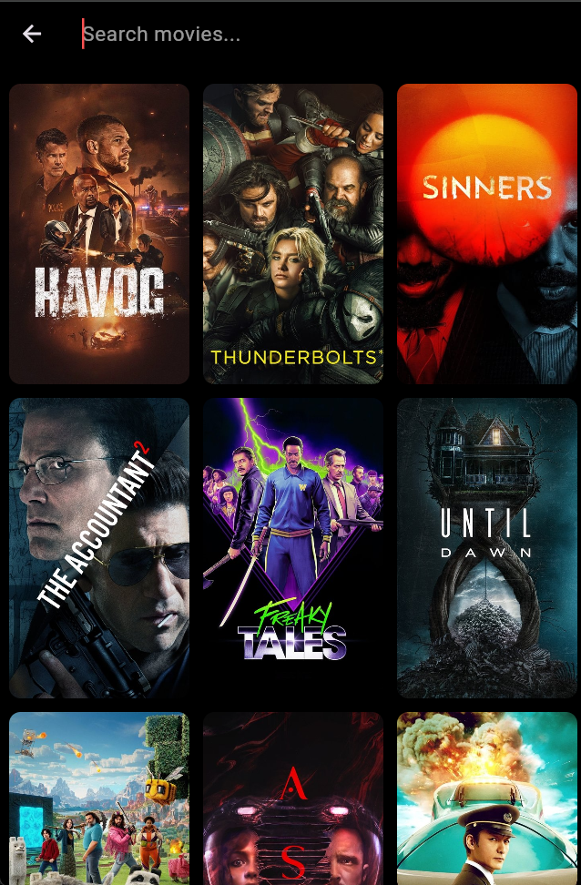
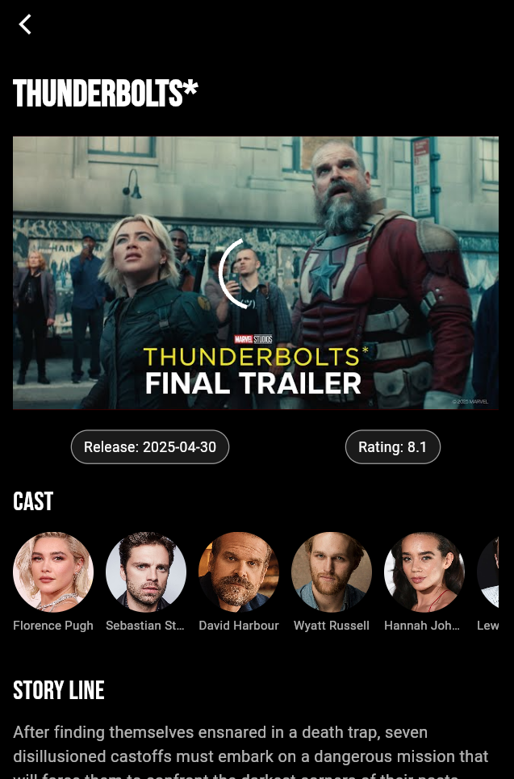

🎬 Netflix Clone App
=======================================

Welcome to **Netflix**, a beautifully designed Flutter application where users can explore trending, top-rated, and upcoming movies, watch trailers, view cast information, and more!

Built fully in **Flutter**, using **TMDB API** (The Movie Database) to fetch real-time movie, trailer, and cast data.

🛠 Setup Instructions
---------------------

1.  Clone the repository:
    
    *   git clone https://github.com/your-username/FlutFlix.git
        
    *   cd FlutFlix
        
2.  Install Flutter dependencies:
    
    *   flutter pub get
        
3.  Get your TMDB API Key:
    
    *   Create an account at [https://www.themoviedb.org/](https://www.themoviedb.org/)
        
    *   Go to Settings > API > Request an API Key
        
    *   Replace the Constants.apiKey value inside constants.dart with your API key.
        
4.  Run the app:
    
    *   flutter run
        

📂 Project Architecture
-----------------------

lib/

*   api/ → API service class (Api.dart)
    
*   models/ → Data Models (Movie.dart, Cast.dart)
    
*   screens/ → Screens (HomeScreen, SearchScreen, DetailsScreen)
    
*   widgets/ → Reusable Widgets (MovieSlider, TrendingSlider, etc.)
    
*   constants.dart → API Key, Image base URL
    
*   main.dart → App Entry Point
    

📦 Libraries and Packages Used
------------------------------

*   http → For API requests (TMDB API)
    
*   google\_fonts → Custom fonts like BebasNeue, Roboto
    
*   youtube\_player\_flutter → Embedding YouTube trailers inside the app
    
*   shimmer → Beautiful shimmer loading animation
    
*   flutter/material.dart → Flutter’s core UI toolkit
    

🎯 Features Implemented
-----------------------

### ✅ Home Screen

*   Netflix-styled dark home page.
    
*   Top bar with Netflix logo, search button, and category tabs (All, Shows, Movies, Sports, News).
    
*   Auto-sliding Featured Movie Banner with Dots Indicator.
    
*   "Most Watched", "Recently Added", "Best Rated" tabs with vertically scrolling movie grids (3 movies per row).
    

### ✅ Search Screen

*   Search bar at the top.
    
*   Real-time movie search as you type.
    
*   Shimmer loading effect while movies are being fetched.
    
*   Grid view displaying movie posters (3 per row).
    
*   Hero animations for smooth poster transitions.
    
*   Open detailed movie screen on click.
    

### ✅ Details Screen

*   Title of the movie displayed.
    
*   Embedded YouTube Trailer player inside the app.
    
*   Horizontally scrollable Cast List.
    
*   Storyline and overview.
    
*   Release date and rating tags.
    
*   Netflix-style dark themed background.
    

🔥 TMDB API Endpoints Used
--------------------------

*   /trending/movie/day → Fetch trending movies
    
*   /movie/top\_rated → Fetch top-rated movies
    
*   /movie/upcoming → Fetch upcoming movies
    
*   /movie/{id}/videos → Fetch trailer YouTube key
    
*   /movie/{id}/credits → Fetch cast list
    

📸 Screenshots (Optional Placeholder)
-------------------------------------
## 📸 Screenshots

  
  
  

💬 Credits
----------

*   Built using Flutter ❤️
    
*   Movie data provided by [TMDB (The Movie Database)](https://www.themoviedb.org/)
    

📜 License
----------

This project is licensed under the MIT License.Feel free to use it, modify it, and learn from it!
